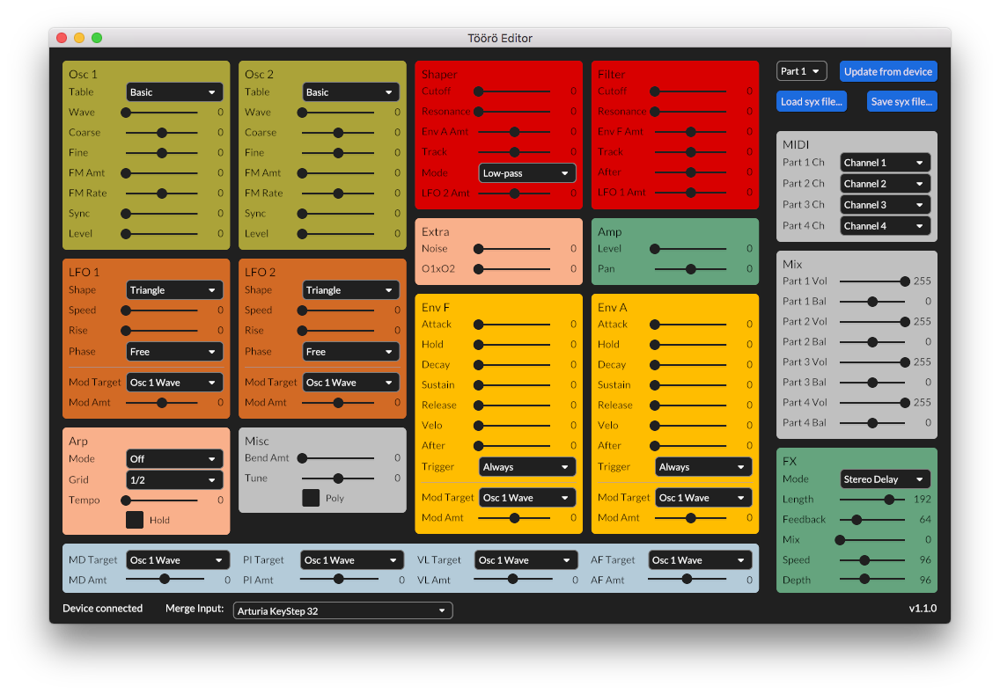

# Töörö Editor

Cross-platform sound editor for the [Fred's Lab Töörö](https://fredslab.net/en/tooro-module.php) hardware synthesizer. This application was developed in close cooperation with the manufacturer.

The application is written in Rust and features the [Iced GUI library](https://github.com/hecrj/iced) and the [midir](https://github.com/Boddlnagg/midir) crate for MIDI processing.

## Features

The editor currently supports:

- Editing of most preset and multi parameters
- Loading and saving of presets as sysex files

Being an open source project, user contributions to the code are always welcome.

## Usage

Using the editor is mostly self-explanatory, but there are a few things to be noted:

- The Töörö must be connected to the computer via USB. DIN MIDI will not work.
- When using a DAW at the same time as the editor, make sure it does not loopback sysex messages to the Töörö.
- You can select a MIDI input for playing the Töörö while editing via the **Merge Input** dropdown list on the bottom of the application window.
- Silders can be fine-controlled by holding the *SHIFT* key while dragging.
- To reset a slider value to it's default, use *CTRL*-click or right-click.
- The mouse wheel can also be used to change a slider value.
- The Töörö firmware must be V1.5 or higher. Otherwise, not all parameters can be edited.
- The application tries to detect when you change a parameter on the device itself. Unfortunately, this will not work in all cases. Use the **Update from device** button to force a reload of all parameters.
- A manual update must also be requested when you change a preset or change a parameter via MIDI CCs from another application or source.
- All sysex files must use **.syx** as file extension.
- On larger screens, the window width can be increased to improve the resolution of the sliders.

## Known Issues

- The connection state is not always detected correctly when the Töörö is connected or disconnected while the application is running.
- Resizing the window height is possible but has no use.
- Using more than one Töörö at a time is not supported.
- On some Linux machines, the application crashes on startup. While the cause is not fully clear, it seems to be related to the configuration of the graphics subsystem.

## Runtime Requirements

The following platforms were tested during development:

- Windows 10
- OS X 10.11 (El Capitan)
- macOS 10.13 (High Sierra)
- macOS 11 (Big Sur)

An **OpenGL ES3** compatible graphics adapter is required on Linux. This can be an issue, especially on older notebooks.

## Build Requirements

To build the application from source, a [Rust toolchain](https://www.rust-lang.org/) is required.

- Use `cargo build` to compile or `cargo run` to compile and run the application in debug mode.
- Use `cargo build --release` to compile or `cargo run --release` to compile and run the application in release mode.

### Windows Installer (optional)

[cargo-wix](https://github.com/volks73/cargo-wix) must be installed to create a Windows installer.

- Run `cargo wix` to build the installer (msi).
- The installer will be created in the `target/wix` folder.

### Mac Application Bundle (optional)

To build a macOS application bundle, additional dependencies must be installed:

- [cargo-bundle](https://github.com/burtonageo/cargo-bundle)
- [Python3](https://python.org) (any recent version should work)

Run `./build-mac-bundle.sh` from the project directory. Make sure the script has executable permissions.

The bundle will be created in the `target/release/bundle/osx` folder.
If the custom app icon does not show up, copy/paste it manually from the icons folder using the finder info dialog.

### Linux AppImage (optional)

To build an AppImage for Linux, additional dependencies must be installed:

- [linuxdeploy](https://github.com/linuxdeploy/linuxdeploy)
- [linuxdeploy-plugin-appimage](https://github.com/linuxdeploy/linuxdeploy-plugin-appimage)

Run `./build-linux-appimage.sh` from the project directory. Make sure the script has executable permissions.
The AppImage will be created in the `./target/release/appimage` directory.

## License

Published under the MIT license. All contributions to this project must be provided under the same license conditions.

Author: Oliver Rockstedt <info@sourcebox.de>

## Donations

If you like to support my work, you can [buy me a
coffee.](https://www.buymeacoffee.com/sourcebox)

